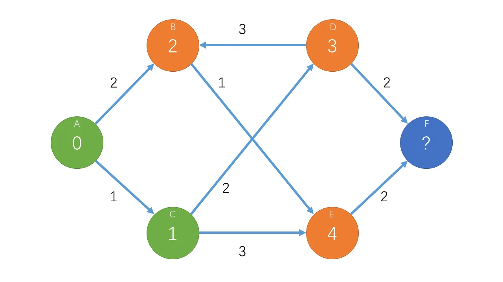

# 算法 | Dijkstra 算法

解决赋权图的单源最短路径问题：Dijkstra (/'daɪkstrəz/, 迪杰斯特拉) 算法。**不能解决负边。**

***

## 朴素版本

### 复杂度

- **时间复杂度：** $O(|V|^2)$
- 此为最坏情况，$|E|$ 为边数，$|V|$ 为顶点数。该版本适合**稠密图**，即 $|E|$ 接近 $|V|^2$ 的图。

### 分析

#### 核心思想

以下图为例，该图为一个有向图，箭头上的数字为权值，且权值均为非负数。



假设我们已经确定了 $A \to A = 0$，$A \to C = 1$，称 $A, C$ 为**确定点**。那么我们计算出可以从确定点一步到达的点的最短距离，即 $A \to B = 2, A \to D = 3, A \to E = 4$，称 $B, D, E$ 为**待定点**。

接下来，我们用贪心思想还能将待定点中距离最小的那个点转化为确定点，即 $B$ 点的距离 $2$ 可以确定是最短的。然后我们就可以用该确定点更新可到达的点，称为**松弛操作**。再循环上述整个过程。

#### 伪代码表示

```
dijkstra (G, dist[])
    初始化: dist[1~v]=+INF, dist[1]=0
    for (循环v次)
        t = 待定点的集合中dist[t]最小的顶点
        记t已确定
        for (j : 从t出发能到达的顶点的集合)
            if (以t为中介点到j的距离更短)
                更新dist[j];
```

### 代码实现

```
const int MAXN = 510, INF = 0x3f3f3f3f; // INF代表无穷大
int g[MAXN][MAXN];    // 邻接矩阵存图
int dist[MAXN];        // 最短距离
bool vis[MAXN];        // 访问情况
int v, e;              // v顶点数, e边数

void dijkstra() {
    memset(dist, 0x3f, sizeof(dist));
    dist[1] = 0;
    for (int i = 1; i <= v; i++) {
        int t = -1;
        for (int j = 1; j <= v; j++)
            if (!vis[j] && (t == -1 || dist[t] > dist[j]))
                t = j;
        vis[t] = true;
        for (int j = 1; j <= v; j++)
            dist[j] = min(dist[j], dist[t] + g[t][j]);
    }
}
```

***

## 堆优化版本

### 复杂度

- **时间复杂度：** $O((|E| + |V|) \log |V|)$
- 此为最坏情况，$|E|$ 为边数，$|V|$ 为顶点数。该版本适合**稀疏图**，即 $|E| \ll |V|^2$ 的图。

### 分析

1. 朴素版本中，每次迭代都有一个查找距离最小顶点的过程，并且对所有点尝试进行了松弛操作，共需要 $2|V|$ 次循环。
2. 针对**查找最小值**这一操作，二叉堆是一个很好的数据结构。我们建立一个小顶堆，即可在 $O(1)$ 时间内取得最小值。
3. 针对**松弛操作**，我们将存图方式改为**邻接表**，所以我们就可以只更新与该点相连的顶点，效率更高。

### 代码实现

使用 STL 库中的优先队列作为堆，由于其没有更新元素的功能，所以节点距离更新后，无法更新堆中的数据。但可以用冗余的方法，节点距离更新后直接插入新距离，旧距离仍然储存在堆中。由于堆顶最小，我们可以保证新距离最先取到，之后若发现取到了旧距离，直接忽略即可（参见循环中的 `continue` 语句）。

```
#include <bits/stdc++.h>
using namespace std;

typedef pair<int, int> PII;
const int MAXN = 100010, INF = 0x3f3f3f3f; // INF代表无穷大

int E, V, S;         // E边数，V顶点数，S起点
vector<PII> edge[MAXN]; // 储存连接关系，二元组为(权值, 终点)
priority_queue<PII, vector<PII>, greater<PII>> pque; // 储存节点，节点距离小的在堆顶
int dist[MAXN];      // 储存节点距离
bool vis[MAXN];      // 是否已经访问过该节点的标志

void dijkstra() {
    memset(dist, 0x3f, sizeof(dist));
    dist[1] = 0;
    pque.push({dist[1], 1});
    
    while (!pque.empty()) {
        PII cur = pque.top();
        pque.pop();
        
        if (vis[cur.second]) continue;
        vis[cur.second] = true;
        
        for (auto next : edge[cur.second]) {
            if (dist[next.second] > dist[cur.second] + next.first) {
                dist[next.second] = dist[cur.second] + next.first;
                if (!vis[next.second])
                    pque.push({dist[next.second], next.second});
            }
        }
    }
}
```

